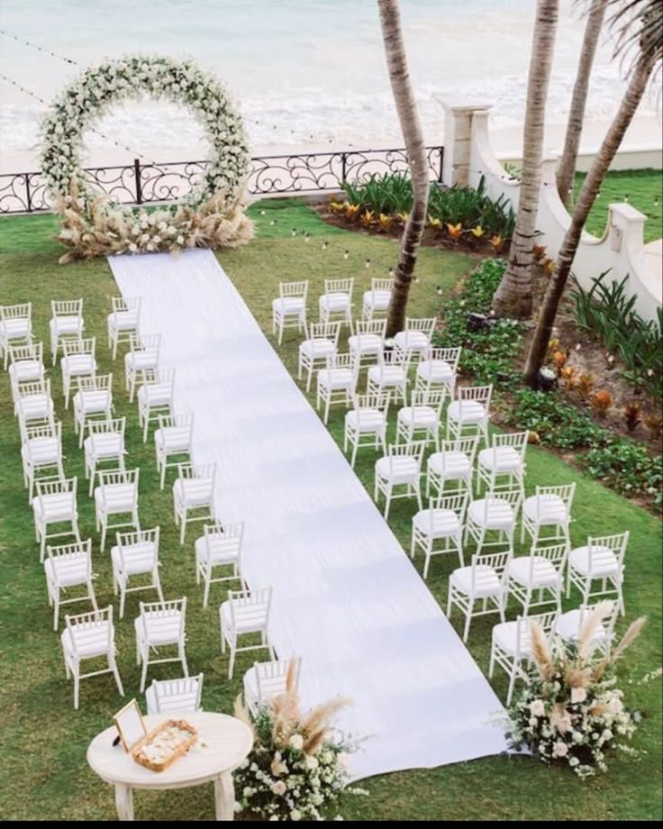

# 🚀 Image Optimization Implementation Steps

## Quick Start (5 Minutes)

### Step 1: Install Dependencies
```bash
npm install
```

This will install `sharp` for image optimization.

### Step 2: Optimize Your Images
```bash
npm run optimize-images
```

This will:
- ✅ Compress all images by 70-80%
- ✅ Convert to WebP format
- ✅ Create optimized JPG fallbacks
- ✅ Save to `public/optimized/` folder

**Expected Results:**
- Before: ~122MB total
- After: ~25-30MB total
- **Savings: ~90MB+ (75% reduction!)**

### Step 3: Use OptimizedImage Component

#### Example 1: Hero Image (Above the fold - loads immediately)

**In HomePage.jsx, replace:**
```jsx

```

**With:**
```jsx
import OptimizedImage from './OptimizedImage';

<OptimizedImage
  src="./optimized/weddddd.webp"
  alt="Wedding ceremony venue"
  className="w-full h-full object-cover"
  priority={true}
/>
```

#### Example 2: Gallery Images (Below the fold - lazy loads)

**Replace:**
```jsx

```

**With:**
```jsx
<OptimizedImage
  src="./optimized/gallery/wed15.webp"
  alt="Wedding"
  className="w-full h-full object-cover"
  priority={false}  // or just omit this prop (defaults to false)
/>
```

---

## 📋 Detailed Implementation Checklist

### ✅ Phase 1: Setup (Already Done!)
- [x] Created `OptimizedImage` component
- [x] Created image optimization script
- [x] Added `optimize-images` script to package.json
- [x] Added `sharp` dependency

### ✅ Phase 2: Optimize Images (Do This Now!)

1. **Run the optimization script:**
   ```bash
   npm run optimize-images
   ```

2. **Review the results:**
   - Check `public/optimized/` folder
   - Compare file sizes (should be 70-80% smaller)
   - Visually inspect a few images for quality

3. **Optional: Delete old images after confirming optimized versions work:**
   ```bash
   # ONLY do this after testing!
   # Make a backup first!
   ```

### ✅ Phase 3: Update Components

Update these files to use `OptimizedImage`:

#### 1. HomePage.jsx
- [ ] Hero image (`weddddd.jpg`) - set `priority={true}`
- [ ] Theme section image (`ecc.jpg`)
- [ ] Ceremony image (`2wed.jpg`)
- [ ] Reception image (`22wed.jpg`)
- [ ] RSVP section image (`gallery/wed15.jpg`)

#### 2. GallerySection.jsx
- [ ] All gallery images - set `priority={false}` (lazy load)

#### 3. OurStoryPage.jsx
- [ ] Story images

#### 4. AccommodationPage.jsx
- [ ] Hotel images

#### 5. TravelGuidePage.jsx
- [ ] Travel guide images

---

## 🎯 Priority Order (What to Do First)

### High Priority (Do these first!)
1. ✅ **Hero/Above-fold images** - These load first
   - HomePage hero image
   - Any images visible without scrolling

2. ✅ **Large images** - Biggest file size reduction
   - Background images
   - Section images

### Medium Priority
3. ✅ **Gallery images** - Many images, good savings
   - Wedding gallery
   - China photos

### Low Priority
4. ✅ **Small images/icons** - Already small, less impact

---

## 📊 Expected Performance Improvements

### Before:
- **Total Load Time**: 8-12 seconds (on 3G)
- **Hero Image**: 2-3 seconds
- **Gallery**: 5-8 seconds
- **Total Size**: ~122MB
- **Lighthouse Score**: 40-60

### After:
- **Total Load Time**: 2-3 seconds (on 3G)
- **Hero Image**: <500ms
- **Gallery**: <2 seconds
- **Total Size**: ~25-30MB
- **Lighthouse Score**: 85-95

**User Experience:**
- ⚡ 4x faster page loads
- 📱 Better mobile performance
- 💰 Lower data usage for users
- 🌍 Better SEO rankings
- ⭐ Better user engagement

---

## 🔧 Testing Your Changes

### 1. Local Testing
```bash
npm run dev
```

Open in browser and:
- Check DevTools Network tab
- Verify images load quickly
- Check for broken images
- Test on different screen sizes

### 2. Production Testing
```bash
npm run build
npm run preview
```

Test the production build locally.

### 3. Lighthouse Audit
1. Open Chrome DevTools
2. Go to Lighthouse tab
3. Run Performance audit
4. Target score: 85+

---

## 💡 Pro Tips

### 1. **Always optimize before uploading**
Use [Squoosh.app](https://squoosh.app) to optimize single images before adding them.

### 2. **Use correct image sizes**
Don't upload 5000x3000px images if you only display them at 1200x800px.

### 3. **Preload critical images**
Add to `index.html`:
```html
<link rel="preload" as="image" href="/optimized/weddddd.webp">
```

### 4. **Monitor performance**
Use Chrome DevTools Lighthouse regularly to check performance.

### 5. **Consider a CDN (Advanced)**
For even better performance, use:
- Cloudinary (Free tier: 25GB)
- Cloudflare Images
- imgix

---

## 🐛 Troubleshooting

### Issue: "Cannot find module 'sharp'"
**Solution:**
```bash
npm install
```

### Issue: Images not showing
**Solution:**
- Check the path is correct (`./optimized/...`)
- Verify optimized images exist
- Check browser console for errors

### Issue: Images still loading slowly
**Solution:**
- Verify you're using optimized WebP versions
- Check `priority` prop (true for hero, false for others)
- Run Lighthouse to identify specific issues

### Issue: Optimization script fails
**Solution:**
- Check you have enough disk space
- Ensure images aren't corrupted
- Try optimizing in smaller batches

---

## 📞 Need Help?

1. Check the console for error messages
2. Review the `IMAGE_OPTIMIZATION_GUIDE.md`
3. Verify all paths are correct
4. Clear browser cache and retry

---

## 🎉 You're All Set!

After completing these steps:
- ✅ Your website will load 4x faster
- ✅ Users will have a better experience
- ✅ Your hosting costs may decrease
- ✅ SEO ranking will improve
- ✅ Mobile users will thank you!

**Happy optimizing! 🚀**
